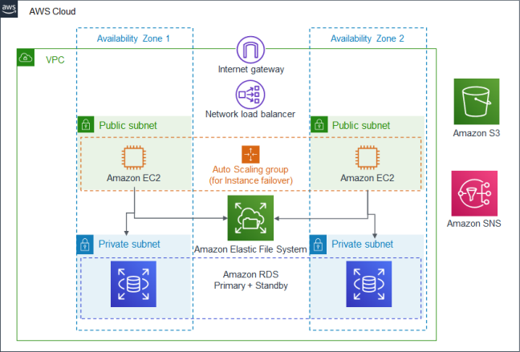

:xrefstyle: short

Deploying this Quick Start for a new virtual private cloud (VPC) with default parameters builds the following HVR environment in the AWS Cloud.

// Replace this example diagram with your own. Follow our wiki guidelines: https://w.amazon.com/bin/view/AWS_Quick_Starts/Process_for_PSAs/#HPrepareyourarchitecturediagram. Upload your source PowerPoint file to the GitHub {deployment name}/docs/images/ directory in this repo.

[#architecture1]
.Quick Start architecture for {partner-product-short-name} on AWS

As shown in <<architecture1>>, the Quick Start sets up the following:

* A highly available architecture that spans two Availability Zones.
* A newly created VPC configured with public and private subnets, according to AWS best practices, to provide you with your own virtual network on AWS.

* In the public subnets:

** Managed network address translation (NAT) gateways to allow outbound internet access for resources in the private subnets.
** A Linux bastion host in an Auto Scaling group to allow inbound Secure Shell (SSH) access to EC2 instances in public and private subnets. The Linux host is based on the HVR BYOL Marketplace image and will allow you to access the HVR GUI to configure the HVR software components in the private subnets.

* In the private subnets:
** The HVR Hub instance is Linux based and part of an Auto Scaling group behind a network load balancer. Only one HVR Hub instance will be created, with an EFS file system attached. In case of failure, a new HVR Hub host will be created and attached to the EFS filesystem.
** Two Linux-based HVR Agent instances in an Auto Scaling group behind a Network Load Balancer will be created.
** An AWS Aurora PostgreSQL database for use as the HVR Hub repository database. Creating the Aurora PostgreSQL database is highly recommended, but optional if you already have an existing database for use as the HVR Hub repository.

* **Restricted Port Access**
** Port 22 and 8080 is open for connections to the Bastion host.
*** Port 22 is used for SSH access (note that a valid key pair is required to access the host).
*** Port 8080 can be used to access the HVR Web Desktop to establish a remote connection to the HVR Hub for configuration.
** The HVR Hub and Agents are behind Network Load Balancers using port 4343 for HVR Communication.
** The Bastion host will be able to connect to the Hub and Agents via port 4343 and 22 (SSH) - ssh will require the specified key pair.

// Add bullet points for any additional components that are included in the deployment. Make sure that the additional components are also represented in the architecture diagram. End each bullet with a period.

In summary all components created include:

* Bastion host - based on HVR BYOL Marketplace Image.
* HVR Hub Instance - based on the HVR BYOL Marketplace Image.
* HVR Agent Instances (2) - based on the HVR BYOL Marketplace Image.
* Network Load Balancers.
* Secrets Manager - Used for Database and OS User Passwords.
* Secrets Manager - A secret with the HVR License information should be created and the details supplied on execution of the quickstart to allow the HVR components to access and use the license details.
* Secrets Manager - Used for the HVR Public/Private certificates for secure communication. Sample certificates are provided as part of the templates.
* Aurora PostgreSQL - Database used as HVR Hub Repository.

