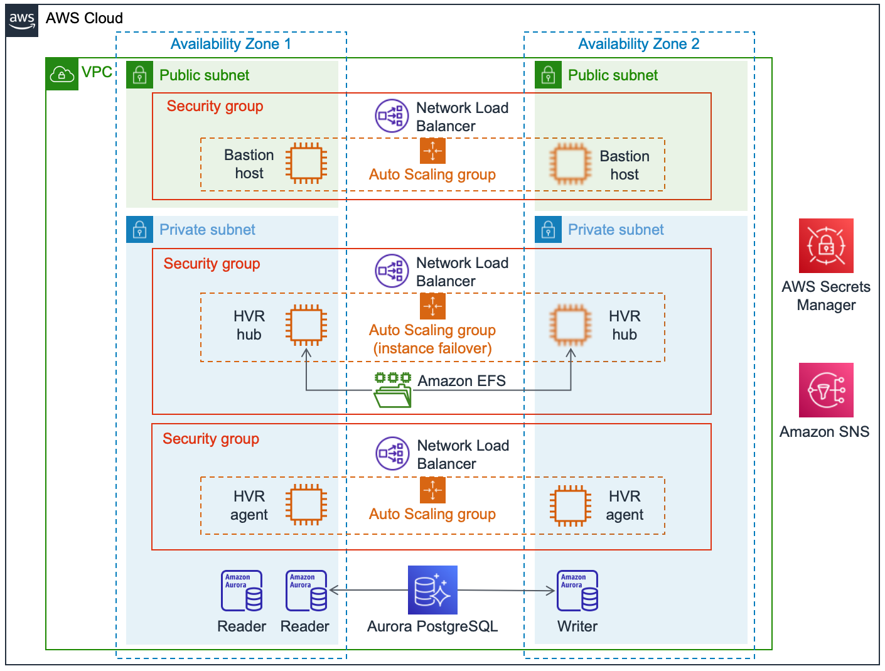

:xrefstyle: short

Deploying this Quick Start for a new virtual private cloud (VPC) with default parameters builds the following HVR environment in the AWS Cloud. 

[#architecture1]
.Architecture for the {partner-product-name} Quick Start on AWS

As shown in <<architecture1>>, the Quick Start sets up the following:

* A highly available architecture that spans two Availability Zones.
* A VPC configured with public and private subnets, according to AWS best practices, to provide you with your own virtual network on AWS.

* In the public subnets:
** A Linux bastion host in an Auto Scaling group that provides inbound Secure Shell (SSH) access to EC2 instances in public and private subnets. The bastion host is based on the HVR BYOL Marketplace image. With this bastion host, you can use the HVR graphical user interface (GUI) to configure the HVR software components—the HVR hub and agents—in the private subnets.
** A security group is defined which will allow ingress port 22 (for SSH) and 8080 (for HVR Webdesktop).  Egress porst are limited to only a few, example port 22, 8080, 4343 and 443.  A Network Load Balancer (NLB) is used to direct traffic to the Bastion host which could be placed in any of the Avalability Zones in the public subnet.
//TODO Tony, Please add a reference to the security group in the public subnets. – Resolved
//TODO Tony, Please also add a reference to the Network Load Balancer (NLB) that's associated with that security group. – Resolved

* In the private subnets:
** A Linux-based HVR hub instance in an Auto Scaling group behind a Network Load Balancer. This instance, which is based on the HVR BYOL Marketplace image, controls all replication flows. It's attached to an Amazon Elastic File System (EFS) file system to provide high availability. If the instance fails, a new HVR hub host is created and attached to the EFS file system.
** Two Linux-based HVR agent instances in an Auto Scaling group behind a Network Load Balancer. These instances are based on the HVR BYOL Marketplace image.
** (Optional) An Amazon Aurora PostgreSQL-Compatible Edition repository database for the HVR hub - if selected to create this you will be presented with an environment which includes multiple reader instances with one writer. Alternatively, you can use an existing database if you prefer. This database does not have to be PostgreSQL; other supported databases include MySQL, MariaDB, SQL Server, and Oracle.
** The HVR hub and Agent instances are also protected by addtional Security Groups which will limit Ingress ports to 4343 (HVR), 22 (SSH), 2049 (EFS).  Egress ports are not limited.
//TODO Tony, Please add a reference to the security group in the private subnets. – Resolved
//TODO Tony, Please add a reference to the reader and writer icons. – Resolved

* AWS Secrets Manager, is used for storing secrets used by the Quick Start, these include database and operatings sytem (EC2) user passwords, the HVR License and Public and Private keys used for secure communication.  The deployment process does provides details that enable the HVR components to access and use these secrets. Sample certificates (public and private) are provided as part of the Quick Start.
//TODO Tony, How could we phrase the preceding bullet more simply and concisely? – Resolved
* (Optional) Amazon Simple Notification Service (Amazon SNS), is used by the (Optional) Amazon Aurora PostgreSQL environment for cloudwatch alarms and RDS Event notifications.
//TODO Tony, Please fill in the SNS blank. – Resolved

* Restricted port access:
** Port 22 and 8080 is open for connections to the bastion host.
*** Port 22 is used for SSH access. A valid key pair is required to access the host.
*** Port 8080 can be used to access the HVR web desktop to establish a remote connection to the HVR hub for configuration.
** The HVR hub and agents are behind Network Load Balancers using port 4343 for HVR Communication.
** The bastion host can connect to the hub and agents using port 4343 and 22 (SSH). SSH requires the specified key pair.
//TODO Tony, Please move this information about the ports to the section where people need it. The bulleted list in this "Architecture" section includes only the elements shown in the diagram.