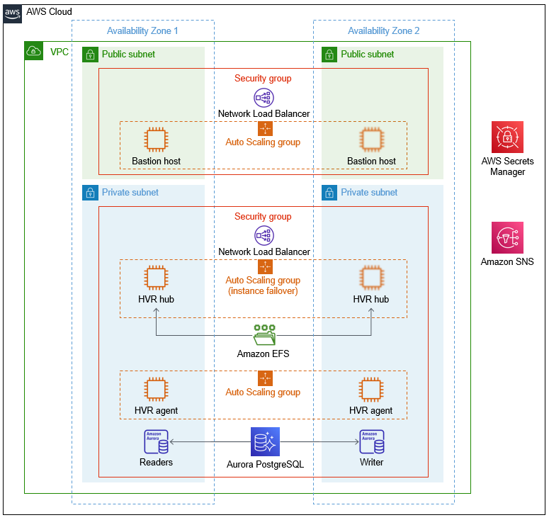

:xrefstyle: short

Deploying this Quick Start for a new virtual private cloud (VPC) with default parameters builds the following HVR environment in the AWS Cloud.

[#architecture1]
.Architecture for the {partner-product-name} Quick Start on AWS

As shown in <<architecture1>>, the Quick Start sets up the following:

* A highly available architecture that spans two Availability Zones.
* A VPC configured with public and private subnets, according to AWS best practices, to provide you with your own virtual network on AWS.
* Two Network Load Balancers to direct traffic, one for the public subnets and one for the private subnets. Each Network Load Balancer is located within a security group.

* In the public subnets:
** A Linux bastion host in an Auto Scaling group that provides inbound Secure Shell (SSH) access to EC2 instances in public and private subnets. The bastion host is based on the HVR BYOL AMI in AWS Marketplace. With this bastion host, you can use the HVR graphical user interface to configure the HVR software components—the HVR hub and agents—in the private subnets.
** A security group for limiting inbound traffic from port 22 (for SSH) and 8080 (for `hvrwebdesktop`). Outbound traffic is limited to ports 22, 8080, 4343, and 443.

* In the private subnets:
** A Linux-based HVR hub instance in an Auto Scaling group. This instance, which is based on the HVR BYOL AMI, controls all replication flows. 
** Two Linux-based HVR agent instances in an Auto Scaling group, one instance in each private subnet. These instances, which are based on the HVR BYOL AMI, are close to replication endpoints.
** A security group for limiting inbound traffic to ports 4343 (HVR), 22 (SSH), 2049 (Amazon EFS). Outbound traffic is not limited.

* An Amazon Elastic File System (Amazon EFS) file system attached to the HVR hub instance for high availability. If the HVR hub instance fails, a new one is created and attached to the EFS file system.
* (Optional) An Amazon Aurora PostgreSQL–compatible repository database for the HVR hub. This option includes multiple reader instances in one private subnet and one writer in the other private subnet. Alternatively, you can use an existing database. The database does not have to be PostgreSQL. Other supported databases include MySQL, MariaDB, SQL Server, and Oracle.
* AWS Secrets Manager for storing secrets, such as passwords used by the Quick Start. These secrets include database and operating system (EC2) user passwords, the HVR license, public keys, and private keys used for secure communication. The deployment process provides details that enable the HVR components to access and use these secrets.

* (Optional) Amazon Simple Notification Service (Amazon SNS), which the Amazon Aurora PostgreSQL–compatible environment uses for alarms and event notifications.